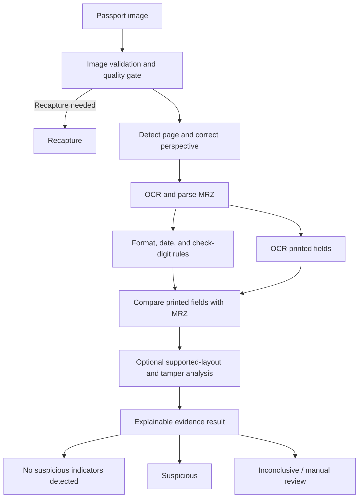

# 🛂 Passport Fake & Tamper Detection

> **A practical student project for identifying suspicious passport images—without relying on government databases.**

Build an image-based software system that detects **known signs of passport alteration** by combining OCR/MRZ validation, checks between printed fields, and (as the project grows) document-layout and tamper analysis.

| Project at a glance | |
|---|---|
| **Goal** | Flag evidence that a passport data page may be altered or counterfeit |
| **Starting scope** | Passport image + OCR/MRZ checks + printed-field consistency |
| **Suggested stack** | Python · FastAPI · OpenCV · local OCR · Streamlit |
| **Government access needed?** | No |
| **Key limitation** | An image-based prototype cannot prove a passport is genuine |

> **Set the right expectation:** A valid MRZ or a clean-looking image is not proof of authenticity. The system should report **suspicious**, **inconclusive**, or **no suspicious indicators detected by the checks performed**—never make an unsupported guarantee that a passport is genuine.

## 🧭 Contents

- [Best feasible approach](#-best-feasible-approach)
- [Project scope](#-project-scope)
- [Technology choices](#-technology-choices)
- [How the system works](#-how-the-system-works)
- [What counts as suspicious](#-what-counts-as-suspicious)
- [Build roadmap](#-build-roadmap)
- [Evaluation, privacy, and limitations](#-evaluation-privacy-and-limitations)
- [Suggested project structure](#-suggested-project-structure)
- [References](#-references)

## 🔎 Best feasible approach

Do not depend on one AI model or pixel-by-pixel matching. Use independent checks so each can contribute evidence:

1. **Check image quality** and request a recapture if the page is blurred, cropped, or obscured by glare.
2. **Find and rectify the passport page** and identify whether it belongs to a supported document family.
3. **Read and validate the MRZ** using OCR, format/date rules, and deterministic ICAO check-digit calculations.
4. **Cross-check printed fields** from the visual inspection zone (VIZ) against corresponding MRZ fields.
5. **Compare supported layouts** with lawfully obtained reference specimens.
6. **Add tamper analysis later**, training and evaluating region-level models only after collecting permitted, labelled examples.
7. **Explain every outcome** by showing checks that passed, failed, or could not be assessed.

This layered approach is achievable for a college project and does not require government access. Its strength is detecting **known inconsistencies and tampering indicators**, not universally authenticating every passport. Future chip verification or authoritative status checks would require suitable lawful access and are outside the initial build.

## 🎯 Project scope

### First version

- Accept a passport data-page image and report whether it is usable for fake/tamper detection.
- Locate and rectify a supported passport page.
- Extract and parse its MRZ (begin with the ICAO TD3 passport format).
- Validate MRZ structure and check digits deterministically.
- Extract selected printed visual inspection zone (VIZ) fields and compare them with corresponding MRZ fields.
- Return evidence and quality indicators with one of these outcomes:
  - **No suspicious indicators detected:** the checks that ran did not find a known inconsistency; this is not proof of genuineness.
  - **Suspicious:** one or more checks found an explainable mismatch or anomaly.
  - **Inconclusive:** image quality is poor, OCR is uncertain, or required checks are unsupported.
- Recommend **recapture** or **manual review** when evidence is insufficient or conflicting.

### Later research stages

- Compare layout and regions against a limited, documented set of permitted passport-family specimens.
- Evaluate region-level image-forensic/tamper models using controlled, labelled examples.
- Expand document-family coverage only when representative data and evaluation results support it.
- If lawful test material and hardware become available, add NFC/e-passport chip signature validation as a separate, higher-assurance evidence source.

### Out of scope for the first version

- NFC/e-passport chip reading and cryptographic validation.
- Government issuer, stolen-document, or watchlist services.
- Universal coverage of passport countries, editions, security features, or attack types.
- A legal or operational decision to accept/reject a traveler, or identity matching against the presenter.

## 🧰 Technology choices

| Layer | Recommended starting point | Alternatives and trade-offs |
|---|---|---|
| Language/API | Python with FastAPI | Flask is a smaller, familiar option, but FastAPI provides typed request/response validation and API docs with little extra setup. |
| Image processing | OpenCV and NumPy | OpenCV is a practical, mature choice for quality checks, page boundaries, perspective correction, and image normalization. Keep these steps deterministic where possible. |
| OCR | Benchmark Tesseract and PaddleOCR on the chosen data before selecting | Tesseract is light, open source, and can run offline, but MRZ accuracy depends on image quality and preprocessing. PaddleOCR offers integrated detection/recognition and may improve results on varied captures, at the cost of larger dependencies and more deployment tuning. A managed OCR API may be convenient, but sends highly sensitive document images outside the local system and can add cost and compliance requirements. |
| MRZ validation | A small, tested deterministic parser | Do not ask a neural network to validate check digits. Implement format/length checks and the ICAO MRZ 7-3-1 weighted check-digit calculation, with unit tests for valid and intentionally changed fields. |
| VIZ/MRZ consistency | OCR output plus normalized field comparison | Use explicit normalization for spaces, filler characters, dates, and known OCR confusions; preserve raw OCR output so the comparison remains auditable. |
| UI | Streamlit for the first demo | Fast to build for an academic prototype. React/Next.js is better for a more polished operator workflow but requires a separate frontend and API integration. |
| Persistence | No image retention by default; SQLite for optional local metadata | SQLite is sufficient for a single-user demo. PostgreSQL is a stronger choice for a multi-user service, but neither database should receive passport images or OCR data unless there is a clear need and approved retention/security policy. |
| Tamper ML | PyTorch only after a controlled dataset and non-ML baseline exist | CNN/ViT or anomaly-detection approaches can provide region-level signals, but can overfit capture devices, templates, or synthetic editing artifacts. They add little defensible value without representative labels and held-out testing. |
| Packaging | Docker once the local pipeline is reproducible | Containerization helps repeatable demos and deployment, but should follow a working local prototype rather than delay it. |

### Recommended MVP

Start with **Python + FastAPI + OpenCV + a locally run OCR engine selected by a small benchmark + deterministic MRZ parsing**, and use **Streamlit** for the demo UI. Add supported-family layout checks next. Train/evaluate a tamper-localization model only when there is a controlled dataset and evaluation protocol. This order gives you a useful, testable system before tackling the most data-dependent AI feature.

## ⚙️ How the system works



Each stage should report its own result. A checksum failure, OCR uncertainty, poor image quality, and visual anomaly are different kinds of evidence. A passport passing the available checks means only that no tested inconsistency was detected. If quality is inadequate or evidence conflicts, return **inconclusive**, **recapture**, or **manual review** instead of a confident guess.

## 🚩 What counts as suspicious

The detector should be evaluated against specific attack categories instead of a vague all-purpose fake label:

- **Altered data:** printed name, date, passport number, or other field changed; detected first through MRZ check digits and VIZ/MRZ inconsistency.
- **MRZ alteration:** machine-readable fields changed; detected through OCR, format, check-digit, and visual-field checks.
- **Photo or region manipulation:** replacement or editing evidence in the portrait/text area; requires labelled examples and region-level analysis, and may not be conclusive from an ordinary photo.
- **Counterfeit or unsupported layout:** page structure differs from supported document-family references; an unknown legitimate edition can also trigger this, so unsupported layouts should be inconclusive rather than automatically fake.

The system does **not** determine whether the presenter is the rightful passport holder. That is a separate identity-verification problem.

## 🗺️ Build roadmap

### 1. Define the first test set

- Select one passport format (start with TD3) and a small, explicitly supported document-family set.
- Define allowed input types, image-size limits, supported fields, and what each outcome means.
- Record data provenance, consent/licensing, intended retention, and the tamper categories to evaluate.
- Create baseline cases for unaltered, controlled alterations, non-passports, and unusable images using lawful specimens or synthetic material.

### 2. Build image intake and quality checks

- Validate file type and decoded image content; limit upload size and reject malformed files.
- Check resolution, blur, glare/overexposure, crop, and orientation.
- Detect the document boundary and apply perspective correction with OpenCV.
- Return a specific recapture reason when the page or MRZ cannot be read.

### 3. Implement MRZ OCR and deterministic validation

- Locate the MRZ and benchmark candidate OCR engines on the same held-out sample set.
- Parse the expected line count, character set, and field positions for the selected format.
- Validate check digits, dates, and field formats with deterministic code.
- Preserve raw OCR text and per-field confidence/error information for debugging and review.

### 4. Add VIZ extraction and cross-checks

- Extract only the fields needed for the first comparison.
- Normalize values conservatively; do not silently rewrite ambiguous OCR.
- Compare passport number, dates, and other supported fields against the MRZ.
- Return a field-level match, mismatch, or unknown result with the source text and reason.

### 5. Add explainable visual/tamper evidence

- Start with layout/region checks for the supported document families and simple, documented image signals.
- Build a controlled dataset with genuine capture variation and clearly labelled, permitted tamper examples.
- Compare a rules/template baseline with candidate ML models; evaluate region localization as well as page-level classification.
- Treat image-forensic scores as supporting evidence, not proof. Ordinary RGB images do not reliably reveal every physical security feature.

### 6. Deliver the API and demo

- Expose a versioned fake/tamper-detection endpoint and a small UI for image submission and evidence review.
- Return structured outcomes rather than only a Boolean. A useful response can include:

```json
{
  "document_type": "passport",
  "image_quality": "acceptable",
  "mrz_status": "valid",
  "viz_mrz_consistency": "mismatch",
  "tamper_analysis": "not_assessed",
  "overall_result": "suspicious",
  "reasons": ["date_of_birth_mismatch"],
  "recommended_action": "manual_review",
  "model_version": "baseline-1"
}
```

- Use a constrained result such as `no_suspicious_indicators`, `suspicious`, or `inconclusive`; keep the recommended action separate.
- Keep unsupported or unrun checks explicitly marked `not_assessed`/`unknown`; do not represent them as passed.

### 7. Evaluate, document, and iterate

- Split evaluation by document specimen/template and capture device or session, not by randomly splitting near-identical images. This reduces leakage and inflated results.
- Report MRZ character error rate, exact field accuracy, check-digit error detection, VIZ/MRZ mismatch precision and recall, and per-attack-category tamper precision/recall. Also report false acceptance (a fake sample gets **no suspicious indicators detected**), false alarms (an unaltered sample gets flagged), inconclusive/recapture rate, and end-to-end latency.
- Include poor lighting, blur, rotation, compression, glare, wear, and unseen capture devices in robustness tests.
- Compare against simple baselines and run ablations to show what each evidence source contributes.
- Publish limitations and results for the tested dataset; do not imply universal passport coverage or readiness for border use.

## 📊 Evaluation, privacy, and limitations

- Prefer synthetic data, permitted specimen images, and consented test samples. Do not acquire illicit passport material.
- Treat passport images, MRZ text, and visual identity fields as sensitive personal data. Avoid retaining uploads and OCR output unless required for the experiment; document any retention and access controls.
- For a deployed service, use authenticated access, encrypted transport, least privilege, upload limits, and auditable access. Do not expose raw passport contents in routine logs.
- Version the rules, OCR engine, and ML model used for every result so an evaluation can be reproduced.
- Present this system as fake/tamper detection support, not proof of authenticity. Human examination is required for suspicious, low-confidence, or conflicting evidence.

## 🗂️ Suggested project structure

The repository currently contains this README. As implementation begins, a simple structure could be:

```text
app/
  api/              # FastAPI routes and request/response schemas
  pipeline/         # image quality, rectification, OCR, and evidence orchestration
  mrz/              # format parsing, normalization, and check-digit rules
  tamper/           # template and later model-based analysis
  ui/               # Streamlit demo
tests/
  unit/             # MRZ, normalization, and quality-rule tests
  integration/      # pipeline/API tests using non-sensitive fixtures
data/
  README.md         # dataset provenance and handling rules; do not commit private documents
```

Keep sample passport images and derived personal data out of version control.

## 📚 References

- `AI_Based_Passport_Authentication_and_Fraud_Detection_Research.pdf` (provided research report).
- `Final_Proposal_AI_Based_Passport_Authentication_System.pdf` (provided proposal).
- ICAO Doc 9303, *Machine Readable Travel Documents* — format and eMRTD reference.
- ICAO Public Key Directory (PKD) — relevant only to a future authorized e-passport verification extension.
- INTERPOL Stolen and Lost Travel Documents (SLTD) — operational access is not assumed by this prototype.

The two supplied reports informed the project boundary, multi-layer evidence pipeline, data strategy, and roadmap. Verify the latest editions and access/licensing conditions before using standards or datasets in a formal submission.